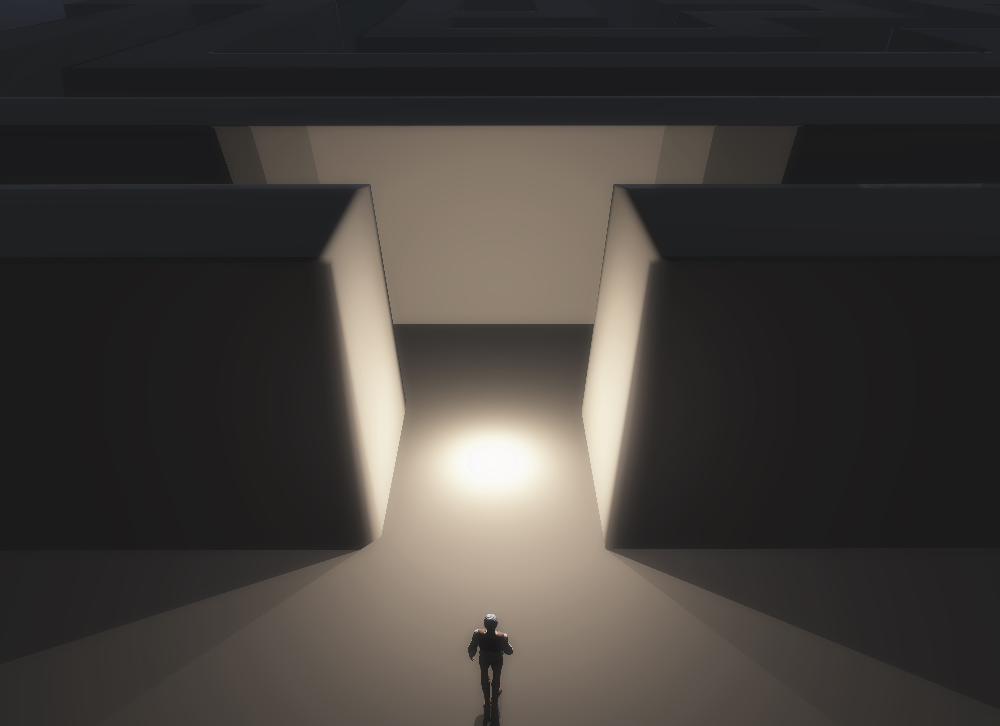

<!-- PROJECT LOGO -->
<br />
<p align="center">
  <a href="https://github.com/othneildrew/Best-README-Template">
    
  </a>
  <br>
  <a href='https://www.freepik.com/photos/background'>Background photo created by kjpargeter - www.freepik.com</a>

  <h3 align="center">Virtual Reality Maze</h3>

  <p align="center">
    A virtual reality experience
    <br />
    <a href="https://github.com/Diezaztek/Virtual-Reality-Maze/issues">Report Bug</a>
    ·
    <a href="https://github.com/Diezaztek/Virtual-Reality-Maze/issues">Request Feature</a>
  </p>
</p>


<!-- TABLE OF CONTENTS -->
<details open="open">
  <summary>Table of Contents</summary>
  <ol>
    <li>
      <a href="#about-the-project">About The Project</a>
      <ul>
        <li><a href="#built-with">Built With</a></li>
      </ul>
    </li>
    <li>
      <a href="#getting-started">Getting Started</a>
      <ul>
        <li><a href="#installation">Installation</a></li>
      </ul>
    </li>
    <li><a href="#usage">Usage</a></li>
    <li><a href="#contributing">Contributing</a></li>
    <li><a href="#license">License</a></li>
    <li><a href="#contact">Contact</a></li>
    <li><a href="#acknowledgements">Acknowledgements</a></li>
  </ol>
</details>


<!-- ABOUT THE PROJECT -->
## About The Project

This repository is for a VR maze experience in Unity. The objective of the game is to find a key for opening a door. In the way you can recolect some coins

### Built With

* [Unity 2017.4.40f1](https://unity3d.com/get-unity/download/archive)


<!-- GETTING STARTED -->
## Getting Started

To get a local copy up and running follow these simple example steps.
### Installation

1. Clone the repo
   ```sh
   git clone https://github.com/Diezaztek/Virtual-Reality-Maze.git
   ```
2. Load the project in Unity
3. Open the Main scene located in Assets/UdacityVR/Scenes


<!-- USAGE EXAMPLES -->
## Usage

![maze][maze]

You can navigate through the maze using the waypoints, which are the green boxes all around the map. Feel free of adding/removing more or changing its location

![waypoint][waypoint]

When you hover on a waypoint the aim will change and the waypoint will increase and decrease its size

![aim][aim]

When you find coins or the key you need to press the action button for you to collect it. They will dissapear and a sound feedback will be played

![key][key]

Right after you find the key, you need to go to the door and click on it. You can change the door speed in its properties

![door][door]

You can find the door properties in Temple/Door

![door-properties][door-properties]

When you get into the temple you will see a "You win" sign. Click it for restarting the game

![reset][reset]


<!-- CONTRIBUTING -->
## Contributing

Contributions are what make the open source community such an amazing place to be learn, inspire, and create. Any contributions you make are **greatly appreciated**.

1. Fork the Project
2. Create your Feature Branch (`git checkout -b feature/AmazingFeature`)
3. Commit your Changes (`git commit -m 'Add some AmazingFeature'`)
4. Push to the Branch (`git push origin feature/AmazingFeature`)
5. Open a Pull Request


<!-- LICENSE -->
## License

Distributed under the MIT License. See `LICENSE` for more information.


<!-- CONTACT -->
## Contact

Francisco Torres - [LinkedIn](https://www.linkedin.com/in/francisco-torres-castillo-386a3a187/)

Project Link: [https://github.com/Diezaztek/Virtual-Reality-Maze](https://github.com/Diezaztek/Virtual-Reality-Maze)


<!-- ACKNOWLEDGEMENTS -->
## Acknowledgements
* [Best-README-Template](https://github.com/othneildrew/Best-README-Template)
* [Udacity](https://www.udacity.com)


<!-- MARKDOWN LINKS & IMAGES -->
[maze]: images/maze.png
[waypoint]: images/waypoint.png
[aim]: images/aim.png
[key]: images/key.png
[door]: images/door.png
[door-properties]: images/door-properties.png
[reset]: images/reset.png